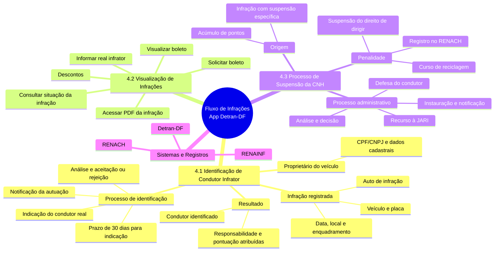
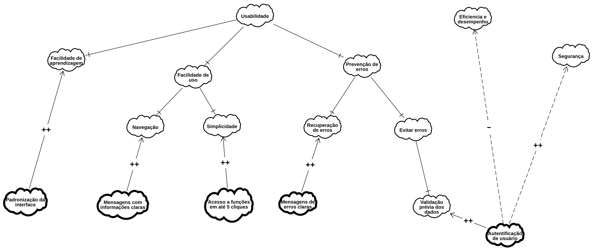
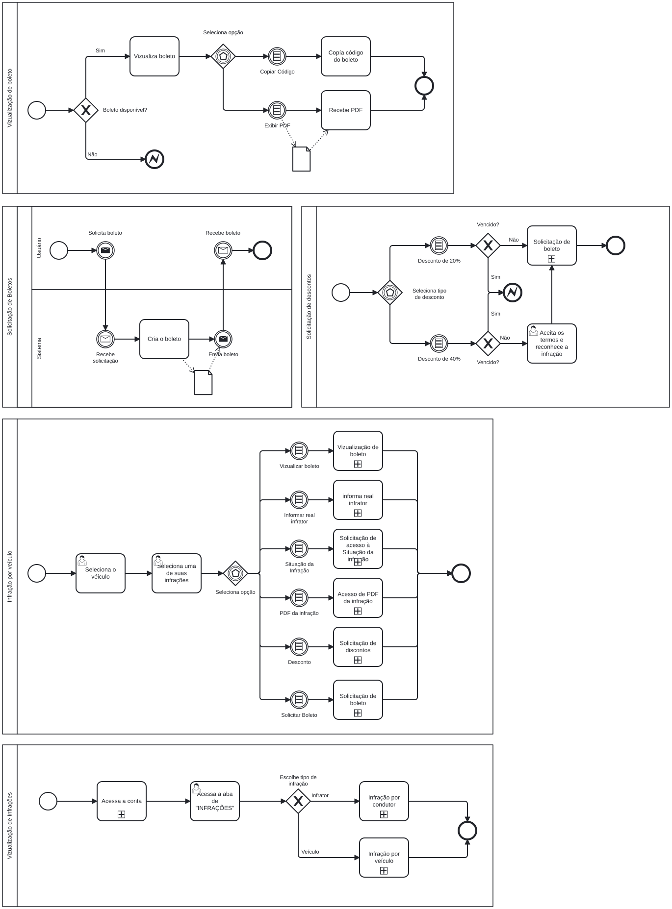

# SubEquipe_02 — Relatório de Arquitetura de Software

**Escopo:** Fluxo de Infrações  
**Aplicação analisada:** aplicativo Detran-DF Digital  
**Subfluxos:**  Identificação de Condutor Infrator ·  Visualização de Infrações ·  Processo de Penalidade de Suspensão de CNH  

---

## Focos do Relatório:

### FOCO_01: Artefatos Generalistas & NFR Framework

### Participantes no Foco_01

| Nome do Membro |
|---|
| Felipe Henrique Oliveira Sousa |
| Matheus Pinheiro |
| [COLEGA C] |

### Metodologia do Foco_01

<!-- RESPONSÁVEL: [COLEGA C] — completar com o que faltar -->

Dividimos o trabalho de modo que todos participassem dos dois artefatos deste foco, sem que cada pessoa ficasse isolada em um artefato só.

No Mapa Mental, um integrante montou a estrutura base com os três eixos do fluxo de infrações e as relações entre eles. Os demais completaram com os detalhes que observaram nos subfluxos pelos quais ficaram responsáveis. No SIG, definimos juntos a decomposição do softgoal principal e cada um ficou responsável por operacionalizar um ramo.

Os artefatos foram versionados em formato editável (`.drawio`) além da imagem exportada, de modo que o histórico do repositório mostra a contribuição de cada integrante.

[COMPLETAR: reuniões que fizemos, como nos comunicamos, decisões que discutimos e o que foi descartado]

---

### Mapa Mental

<!-- INSERIR IMAGEM GERADA NO draw.io / diagrams.net. A versão Mermaid abaixo serve como referência textual -->

**Versão textual de referência (Mermaid):**

autor: [Felipe Henrique Oliveira Sousa]()

**Por que Mapa Mental e não Rich Picture**

Escolhemos o Mapa Mental porque o fluxo de infrações se organiza naturalmente em uma **cadeia hierárquica de processos** com relação de continuidade: Identificação → Histórico → Suspensão. O Mapa Mental permite visualizar essa hierarquia e as dependências entre os três eixos de forma clara (BUZAN; BUZAN, 2006).

O Rich Picture seria útil para representar tensões entre atores (CHECKLAND, 1981), mas neste fluxo as tensões são mais processuais (prazos legais, gateways de decisão) do que interpessoais. A cadeia de dependência — identificação correta → histórico correto → pontuação correta → decisão administrativa correta — ficou mais visível no formato hierárquico.

**Elementos representados**

| Elemento | Responsável |
|---|---|
| Estrutura base com os 3 eixos e a cadeia de continuidade + Subfluxo 4.1 (Identificação de Condutor) | Felipe Henrique Oliveira Sousa |
| Detalhamento do subfluxo 4.2 (Visualização de Infrações), incluindo visualizar boleto, descontos e solicitar boleto | Matheus Pinheiro |
| Detalhamento do subfluxo 4.3 (Processo de Suspensão) + Sistemas e Registros | [COLEGA C] |

---

### NFR Framework

**SIG de Usabilidade na notação do NFR Framework**

autor: [Matheus Pinheiro](https://github.com/matheus-06)

**Por que Usabilidade**  
A Usabilidade é um requisito não funcional importante para o aplicativo, pois os serviços relacionados às infrações devem poder ser utilizados pelo cidadão sem a necessidade de orientação presencial. O usuário precisa compreender as informações apresentadas, localizar as funcionalidades disponíveis e concluir suas ações com o menor esforço possível.

No fluxo de infrações, o cidadão pode consultar informações, acessar documentos e realizar solicitações. Por isso, dificuldades de navegação, excesso de etapas ou mensagens pouco claras podem levar a erros e dificultar a conclusão das tarefas.

Isso torna a Usabilidade um bom softgoal para modelar: não existe um único critério que determine que uma interface está simplesmente "pronta" ou "usável". Em vez disso, o objetivo é decomposto em aspectos menores, como facilidade de aprendizagem, facilidade de uso e prevenção de erros, até chegar em operacionalizações concretas e verificáveis.

Seguimos a notação de Chung et al. (2000). Softgoals são objetivos sem um critério absoluto de satisfação; eles são decompostos em outros softgoals até chegar às operacionalizações, que representam decisões concretas de projeto. Também foram representados links de contribuição para indicar como determinadas decisões podem satisfazer ou prejudicar outros softgoals.

**Decomposição adotada**

| Ramo | Operacionalizações | Responsável |
|---|---|---|
| Facilidade de aprendizagem | Aplicar padrões consistentes de navegação e apresentação das funcionalidades em todas as telas relacionadas ao fluxo de infrações | Matheus Pinheiro |
| Facilidade de uso — Navegação | Exibir informações claras e objetivas para identificar as opções e serviços disponíveis no fluxo de infrações | Matheus Pinheiro |
| Facilidade de uso — Simplicidade | Permitir a conclusão das principais ações relacionadas à infração em até 5 etapas | Matheus Pinheiro |
| Prevenção de erros — Recuperação de erros | Exibir mensagens de erro informando o problema ocorrido e orientando o usuário sobre como corrigi-lo | Matheus Pinheiro |
| Prevenção de erros — Evitar erros | Validar previamente os dados informados antes da confirmação ou envio da solicitação | Matheus Pinheiro |
| Autenticação de usuário | Exigir autenticação válida para realizar ações que envolvam alteração de informações ou responsabilidade sobre uma infração | Matheus Pinheiro |

Note que as operacionalizações foram redigidas de forma verificável. "Facilitar a navegação" não permite uma verificação objetiva; "exibir informações claras e objetivas para identificar os serviços disponíveis" permite observar a interface e avaliar se as informações necessárias estão presentes. Da mesma forma, "permitir a conclusão das principais ações em até 5 etapas" pode ser verificado durante testes de uso.

**Conflitos identificados (links de contribuição)**

| O que satisfazemos | Efeito | Sobre qual softgoal | Por quê |
|---|---|---|---|
| Autenticação de usuário | `++` | Segurança | Impede que usuários não autorizados realizem ações sensíveis relacionadas às infrações |
| Autenticação de usuário | `−` | Eficiência de desempenho | Adiciona uma etapa ao fluxo e pode aumentar o tempo necessário para concluir determinadas ações |
| Exibir informações claras e objetivas | `++` | Navegação | Facilita a identificação dos serviços e opções disponíveis para o usuário |
| Concluir as principais ações em até 5 etapas | `++` | Simplicidade | Reduz a quantidade de interações necessárias para realizar uma tarefa |
| Exibir mensagens de erro claras | `++` | Recuperação de erros | Permite que o usuário compreenda o problema e saiba como corrigir ou continuar a ação |
| Validar previamente os dados informados | `++` | Evitar erros | Identifica informações inválidas antes da confirmação ou envio da solicitação |

O primeiro par é o achado mais relevante do SIG: a autenticação de usuário contribui positivamente para a Segurança, pois impede ações não autorizadas, mas pode prejudicar a Eficiência de desempenho ao adicionar etapas e tempo ao fluxo. É exatamente esse tipo de tensão que o NFR Framework existe para tornar visível.

---

### FOCO_02: Engenharia Reversa & Modelagem BPMN

Entrega Mínima: um modelo, na notação BPMN, do fluxo do software encontrado com a Engenharia Reversa.

### Participantes no Foco_02

| Nome do Membro |
|---|
| Felipe Henrique Oliveira Sousa |
| Matheus Pinheiro |
| [COLEGA C] |

### Metodologia do Foco_02

Cada integrante ficou responsável por percorrer e documentar um par de subfluxos. Os registros de observação foram compartilhados e revisados em conjunto antes da modelagem BPMN.

[COMPLETAR: como cada um percorreu seus subfluxos, como compartilhamos os registros de observação, como decidimos a divisão, que ferramentas de colaboração usamos]

---

### Processo de Engenharia Reversa Aplicado

#### Contexto e escopo

Aplicamos Engenharia Reversa sobre o aplicativo Detran-DF Digital, escolhido por se encaixar no nicho de serviços públicos digitais definido pelo grupo.

Delimitamos o escopo ao **Fluxo de Infrações**, composto por três subfluxos interligados: Identificação de Condutor Infrator (4.1), Visualização de Infrações (4.2) e Processo de Penalidade de Suspensão da CNH (4.3). A principal descoberta da Engenharia Reversa foi que esses três processos não são isolados — formam uma **cadeia de continuidade**.

Não tentamos recuperar o sistema inteiro. O aplicativo também trata de cadastro, CNH digital, veículos e outros serviços, e cada um desses seria um esforço próprio.

#### O que é Engenharia Reversa, e o que ela não é

Chikofsky e Cross (1990) definem Engenharia Reversa como o processo de examinar um software existente para entender como ele funciona e quais requisitos ele implementa, representando isso num nível de abstração mais alto. É o caminho contrário da Engenharia Progressiva, que parte do requisito e desce até o código.

Vale separar Engenharia Reversa de Reengenharia, porque os dois termos costumam ser usados como sinônimo. A primeira só entende e documenta o sistema. A segunda vai além: pega esse entendimento e reconstrói o sistema de outra forma. O nosso trabalho parou na primeira.

#### Como classificamos o nosso esforço

| Elemento | Como ficou no nosso caso | Por quê |
|---|---|---|
| **Nível de abstração** | Projeto (fluxo) | Recuperamos a estrutura dos fluxos e regras de negócio. Não subimos até os requisitos originais |
| **Completude** | Parcial | Cobrimos os subfluxos de infrações, não o sistema inteiro |
| **Interatividade** | Alta | Tudo foi interpretação humana. Nenhuma ferramenta automática extraiu informação — inferir intenção de negócio exige leitura de contexto |
| **Direcionalidade** | Sentido único | O que levantamos serve para entender e documentar. Não alimenta reconstrução do sistema |

#### Técnica usada e limitações

Usamos **análise dinâmica e documental**: observamos o comportamento do sistema em execução e complementamos com a legislação (CTB, Resolução CONTRAN nº 723/2018). Não deu para usar análise estática porque o aplicativo não tem código aberto — ou seja, não conseguimos confirmar nossos achados olhando a implementação. Essa é uma limitação real do trabalho e preferimos declará-la.

**Limitação de elegibilidade:** alguns subfluxos exigem condições que não atendemos — como ter processo de suspensão em andamento ou infração pendente de indicação de condutor. Nesses casos, percorremos até o ponto onde o sistema bloqueia. Isso não é perda: o modo como a aplicação comunica a indisponibilidade é em si um achado.

**Distinção entre tipos de informação:**

| Classificação | Definição | Exemplo neste fluxo |
|---|---|---|
| **Evidência** | Informação presente na legislação, regulamentação ou documentação oficial | Prazo de 30 dias para indicação (art. 257, §7º CTB); limites de pontuação (Lei nº 14.071/2020) |
| **Inferência** | Comportamento deduzido a partir de regras observadas ou do comportamento do app | Verificação automática de limite de pontuação; bloqueio de botão quando prazo expira |
| **Hipótese** | Característica interna que não pôde ser confirmada | Banco de dados, linguagem de programação, arquitetura de APIs, estrutura interna do RENACH/RENAINF |

#### Como fizemos

1. Delimitamos o escopo e mapeamos os subfluxos previstos
2. Cada integrante percorreu seus subfluxos pelo caminho principal, anotando cada tela e transição
3. Repetimos forçando situações de exceção para descobrir validações
4. Registramos o texto das mensagens e avisos exibidos, por revelarem regras de negócio
5. Complementamos com pesquisa normativa (CTB, Lei nº 14.071/2020, Resolução CONTRAN nº 723/2018)
6. Consolidamos os registros e identificamos as regras de decisão
7. Representamos em BPMN, com raias para separar responsabilidades

#### Ferramentas

| Ferramenta | Para quê |
|---|---|
| Aplicativo Detran-DF em dispositivo móvel, com conta própria | Observação do sistema em execução |
| bpmn.io | Edição e exportação do modelo BPMN 2.0 (recomendada no iProcess) |
| diagrams.net (draw.io) | Elaboração do SIG e do Mapa Mental |
| Git / GitHub | Versionamento dos artefatos e rastreabilidade das contribuições |

#### Achados

**Subfluxo 4.1 — Identificação de Condutor Infrator — Felipe Henrique Oliveira Sousa**

**1. A cadeia de continuidade entre os 3 processos.** Este foi o achado mais relevante. Partimos da suposição de que seriam três funcionalidades independentes. A observação e a legislação mostraram que formam uma cadeia: a identificação correta do condutor determina a atribuição de responsabilidade → que alimenta o histórico → que pode desencadear o processo de suspensão.

**2. Bloqueios temporais na interface.** A opção "Indicar Condutor" fica desabilitada quando a data atual ultrapassa o prazo legal. É validação client-side que impede envio de dados intempestivos ao servidor — otimização descoberta pela observação da interface, não pela documentação.

**3. Indicação assíncrona com dois atores.** Na identificação de condutor, o fluxo não termina quando o proprietário envia a indicação. O CTB prevê análise da indicação pelo órgão competente, e o sistema pode entrar em estado de "Aguardando" enquanto a indicação é processada. Isso é relevante para o BPMN porque requer representação de espera entre raias.

**4. Limites de pontuação diferenciados.** A Lei nº 14.071/2020 estabelece limites variáveis (20, 30 ou 40 pontos em 12 meses) conforme a quantidade de infrações gravíssimas do condutor. A pontuação por natureza é: Gravíssima (7pts), Grave (5pts), Média (4pts), Leve (3pts).

**Subfluxo 4.2 — Visualização de Infrações — Matheus Pinheiro**

Através da interação com o aplicatico foi notado que o usuário tem as seguintes funções: 
- Infrações por veículo:
  - visualizar o boleto
  - informar o real infrator
  - consultar a situação da infração
  - acessar o PDF da infração
  - consultar descontos e solicitar boleto.

- Infrações por condutor

Além da vizualização no próprio aplicativo foi acessado o [site do senatran](https://portalservicos.senatran.serpro.gov.br/static/carteiradigital/tutoriais/html/demo_22.html) para ver funções que necessitam de infrações para prosseguir

**Subfluxo 4.3 — Processo de Suspensão — [COLEGA C]**

[preencher: achados da observação do processo de penalidade de suspensão]

#### Questões éticas e de privacidade

Observamos apenas o comportamento externo do aplicativo, usando contas dos próprios integrantes e com finalidade acadêmica. Não descompilamos nada, não extraímos código e não tentamos contornar proteção.

Como o aplicativo lida com dados pessoais sensíveis (CPF, CNH, histórico de infrações, pontuação), nenhuma captura de tela contendo dado identificável foi incluída neste relatório ou versionada no repositório público. Essa decisão segue os princípios de minimização e finalidade da LGPD (Lei nº 13.709/2018).

---

### Modelagem BPMN

#### Fluxo Integrado de Infrações

autor: [Matheus Pinheiro](https://github.com/matheus-06)

[Arquivo editável BPMN](../Base/assets/diagram.bpmn)

O diagrama principal mostra a cadeia de continuidade entre os três subfluxos. Cada subfluxo pode ser detalhado como **subprocesso expandido**, recurso previsto na especificação BPMN 2.0 (OMG, 2013).

Escolhemos essa decomposição porque desenhar os três subfluxos expandidos num único diagrama deixaria o modelo ilegível. Com subprocessos, dá para ver o encadeamento geral numa tela só e detalhar cada parte separadamente.

#### Subprocessos expandidos

| Subfluxo | Diagrama | Responsável |
|---|---|---|
| 4.1 Identificação de Condutor Infrator | `Fluxo Integrado de Infrações` | Felipe Henrique Oliveira Sousa |
| 4.2 Visualização de Infrações | `Vizualização de Infrações` | Matheus Pinheiro (visualização de boleto, solicitação de boleto e solicitação de descontos) |
| 4.3 Processo de Suspensão da CNH | | [COLEGA C] |

##### 4.2 Vizualização de infrações

autor: [Matheus Pinheiro](https://github.com/matheus-06)

#### Recursos de notação que usamos

| Recurso | Onde usamos | Por quê |
|---|---|---|
| Pools | Todos os diagramas | Delimitar os diferentes processos modelados: solicitação de boletos, solicitação de descontos, visualização de boleto e visualização de infrações |
| Raias (lanes) | Solicitação de boletos | Separar as responsabilidades do **Usuário** e do **Sistema** dentro do mesmo processo |
| Evento de início | Todos os fluxos | Indicar o ponto em que cada processo ou interação é iniciada |
| Evento de fim | Todos os fluxos | Representar o encerramento de cada caminho possível do processo |
| Múltiplos eventos de fim | Visualização de boleto e outros fluxos com caminhos alternativos | Permitir que cada resultado possível tenha seu próprio encerramento, como boleto exibido, PDF recebido ou processo encerrado |
| Eventos intermediários | Solicitação de boletos, solicitação de descontos e visualização de infrações | Representar acontecimentos durante o processo, principalmente interações e resultados intermediários antes do encerramento do fluxo |
| Eventos intermediários de mensagem | Solicitação de boletos | Representar a troca de informações entre o usuário e o sistema, como a solicitação e o recebimento do processamento do boleto |
| Gateway exclusivo (XOR) | Solicitação de boletos, solicitação de descontos, visualização de boleto e visualização de infrações | Representar decisões em que apenas um dos caminhos pode ser seguido, como **"Vencido?"**, **"Boleto disponível?"** e escolhas condicionais |
| Gateway baseado em eventos | Solicitação de descontos, visualização de boleto e visualização de infrações | Representar pontos em que a continuação do fluxo depende do próximo evento ou interação que ocorrer, direcionando o processo conforme a opção ou evento recebido |
| Tarefas | Todos os diagramas | Representar as ações executadas pelo usuário ou pelo sistema, como acessar a aba de infrações, selecionar uma infração, visualizar boleto, copiar código ou solicitar desconto |
| Objetos de dados | Visualização de boleto | Representar informações ou documentos manipulados durante o processo, como o PDF relacionado à infração |

---

### FOCO_03: IA Generativa

Entrega Mínima: pontos de vista de cada membro da equipe sobre as lições aprendidas e uso da IA Generativa.
TODOS DEVEM PARTICIPAR!

### Participantes no Foco_03

| Nome do Membro | Lições Aprendidas | Uso da IA Generativa (SENSO CRÍTICO) |
|---|---|---|
| Felipe Henrique Oliveira Sousa | Compreendi como diferentes processos de infrações se conectam em uma cadeia de continuidade — a identificação atribui responsabilidade, que alimenta o histórico, que pode desencadear a suspensão. A Engenharia Reversa revelou como regras legais (prazos de 30 dias, limites de pontuação) são codificadas em validações de interface (botões desabilitados). Também compreendi a importância da distinção entre evidência, inferência e hipótese. | A IA auxiliou na compreensão de jargões do trânsito (Tempestividade, RENAINF, RENACH) e na estruturação inicial do relatório. Porém demonstrou limitações: (1) tentou desenhar o BPMN como fluxo sequencial das 3 ações, quando são cadeia interligada; (2) assumiu tecnologias internas (APIs, SHA-256) como fatos; (3) generalizou procedimentos de diferentes estados; (4) apresentou limites de pontuação desatualizados. Tudo exigiu verificação em fontes oficiais (CTB, Resolução CONTRAN nº 723/2018). |
| Matheus Pinheiro | Consegui aplicar na prática os conteúdos vistos em sala principalmente em relaçãoa criação do BPMN, apesar de que a ferramenta da bizzagi (recomendada) esteve fora do ar no site do iProcess encontrei o bpmn.io que achei muito bom para criação do diagrama apesar de não utilizar cores, além disso pude revisar o mapa mental e criar o FNR na plataforma cin.ufpe  | Utilizado somente para auxílio na escrita do markdown do relatório após a criação dos diagramas e padronização com base nas outras sub equipes  |
| [COLEGA C] |  |  |

---

## Versionamentos

| Nome do Membro | Contribuição | Data |
|---|---|---|
| Felipe Henrique Oliveira Sousa | Estruturação do relatório, pesquisa normativa (CTB, CONTRAN), Mapa Mental (estrutura base + subfluxo ), ramo de Integridade no SIG, Engenharia Reversa do subfluxo e modelagem BPMN do fluxo integrado | 27/08/2026 |
| Matheus Pinheiro | Remodelagem do BPMN de fluxo integrado de inrfações no bpmn.io para seguir as normas | 27/08/2026 |
| Matheus Pinheiro | Alteração no mapa mental subfluxo 4.2 para seguir o BPMN que será criado | 27/08/2026 |
| Matheus Pinheiro | Criação do BPMN do subfluxo 4.2 e explicação da engenharia reversa para criação do fluxo | 27/08/2026 |
| Matheus Pinheiro | Criação do NFR | 28/08/2026 |
| Matheus Pinheiro | Separação de infração por veículo como sub-processo colapsado no BPMN e adição de autores nos diagramas criados | 28/08/2026 |

---

## Referências

BRASIL. **Lei nº 9.503, de 23 de setembro de 1997 — Código de Trânsito Brasileiro (CTB)**. Art. 257, §7º (identificação de condutor) e art. 261 (suspensão). Disponível em: <https://www.planalto.gov.br/ccivil_03/leis/l9503compilado.htm>.

BRASIL. **Lei nº 14.071, de 13 de outubro de 2020**. Altera o CTB e estabelece os limites de pontuação para suspensão do direito de dirigir.

BRASIL. **Lei nº 13.709, de 14 de agosto de 2018.** Lei Geral de Proteção de Dados Pessoais.

BUZAN, T.; BUZAN, B. **The Mind Map Book.** London: BBC Active, 2006.

CHIKOFSKY, E. J.; CROSS, J. H. Reverse engineering and design recovery: a taxonomy. **IEEE Software**, v. 7, n. 1, p. 13-17, 1990.

CHUNG, L.; NIXON, B. A.; YU, E.; MYLOPOULOS, J. **Non-Functional Requirements in Software Engineering.** Boston: Kluwer Academic Publishers, 2000.

CONTRAN. **Resolução nº 723, de 06 de fevereiro de 2018.** Dispõe sobre a uniformização do procedimento administrativo para imposição das penalidades de suspensão do direito de dirigir e de cassação do documento de habilitação.

DETRAN-DF. **Identificação de Condutor Infrator.** Governo do Distrito Federal.

DETRAN-DF. **Multas e Penalidades — Processo de Penalidade de Suspensão do Direito de Dirigir.** Governo do Distrito Federal.

ISO. **ISO/IEC 25010:2023** — Systems and software engineering — Systems and software Quality Requirements and Evaluation (SQuaRE) — Product quality model.

OBJECT MANAGEMENT GROUP. **Business Process Model and Notation (BPMN) — Version 2.0.2.** OMG, 2013.

PRESSMAN, R. S.; MAXIM, B. R. **Engenharia de Software: uma abordagem profissional.** 8. ed. Porto Alegre: AMGH, 2016.

SOMMERVILLE, I. **Engenharia de Software.** 10. ed. São Paulo: Pearson, 2018.
