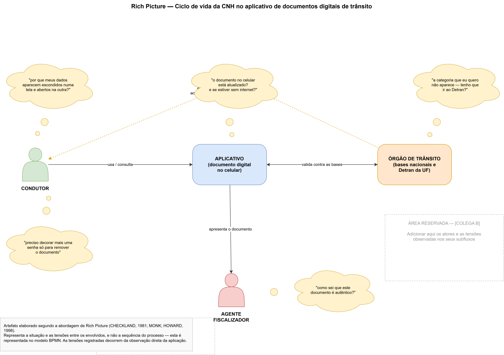
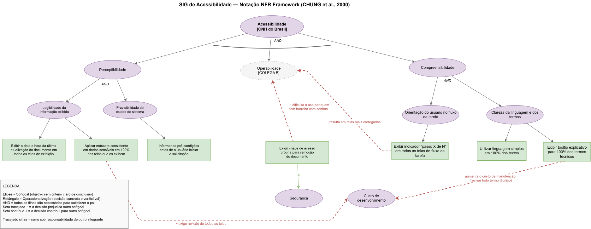
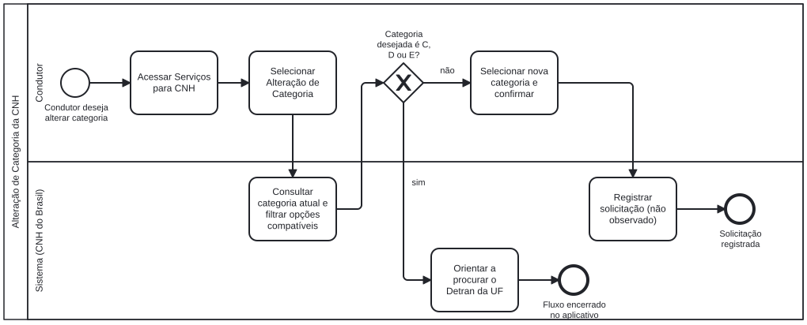

# SubEquipe_03

**Escopo:** Fluxo 3 — CNH
**Aplicação analisada:** aplicativo oficial de documentos digitais de trânsito do governo federal brasileiro
**Subfluxos:** 3.1 Emissão de CNH · 3.2 Acompanhar processo de CNH · 3.3 Vale Carta · 3.4 Consultar CNH · 3.5 2ª Via de CNH · 3.6 CNH Definitiva

---

## Focos do Relatório:

### FOCO_01: Artefatos Generalistas & NFR Framework

Entrega Mínima: um artefato generalista (ESCOPO: Rich Picture ou Mapa Mental) e um SIG na notação do NFR Framework.

### Participantes no Foco_01

| Nome do Membro |
|---|
| Artur Fernandes |
| [Lara Souza Mota] |
| [COLEGA C] |

### Metodologia do Foco_01

<!-- RESPONSÁVEL: [COLEGA C] — completar com o que faltar -->

Dividimos o trabalho por dentro de cada artefato, e não um artefato por pessoa. A ideia foi que todos participassem dos dois artefatos deste foco, sem que ninguém precisasse refazer ou corrigir o trabalho do outro.

No Rich Picture, um integrante montou a base com os atores e as tensões do seu par de subfluxos, deixando áreas demarcadas para os demais completarem com o que observaram. No SIG, definimos juntos a decomposição do softgoal principal e cada um ficou responsável por operacionalizar um ramo.

Os artefatos foram versionados em formato editável (`.drawio`) além da imagem exportada, de modo que o histórico do repositório mostra a contribuição de cada integrante.

[COMPLETAR: reuniões que fizemos, como nos comunicamos, decisões que discutimos e o que foi descartado]

### Rich Picture OU Mapa Mental

**Por que Rich Picture e não Mapa Mental**

Escolhemos o Rich Picture porque ele serve para representar situações problemáticas: mostra os atores, como eles se relacionam e, principalmente, as tensões entre eles (CHECKLAND, 1981). O Mapa Mental organiza conceitos em hierarquia, o que seria útil para mapear o domínio, mas não mostraria conflito.

Como o fluxo analisado envolve atores com interesses diferentes — o condutor quer resolver rápido, o órgão precisa validar contra bases nacionais, o agente precisa conferir autenticidade em campo —, o Rich Picture nos deu mais informação sobre onde estão os atritos reais (MONK; HOWARD, 1998).

Vale notar que Rich Picture e BPMN não competem entre si: o primeiro representa a **situação** e o segundo a **sequência**. Foi por isso que mantivemos os dois.

**Tensões representadas e origem**

| Tensão | De onde veio |
|---|---|
| Dados mascarados numa tela e abertos em outra | Observação direta: a tela de informações do condutor mascara nome e CPF; a de histórico de emissões exibe nome da mãe, endereço completo e CPF sem máscara |
| Necessidade de decorar uma segunda credencial | Observação direta: a remoção do documento exige "chave de acesso" distinta do login federal |
| Dúvida sobre documento atualizado e uso sem internet | Observação direta: a tela exibe carimbo de data e hora da última atualização |
| Como o agente confere autenticidade | Observação direta: existe a ação "Copiar QR Code" na tela do documento |
| Categoria desejada indisponível no aplicativo | Observação direta: as opções são filtradas pela categoria atual, e C, D e E remetem ao Detran da UF |

**Elementos representados**

| Elemento | Responsável |
|---|---|
| Atores base + tensões dos subfluxos observados | Artur Fernandes |
| Tensões dos subfluxos [par do Papel 2] | [COLEGA B] |
| Tensões dos subfluxos [par do Papel 3] | [COLEGA C] |

### NFR Framework

**SIG de Acessibilidade na notação do NFR Framework**

**Por que Acessibilidade**

Acessibilidade é um requisito não funcional obrigatório em aplicação de governo, e não apenas desejável. O eMAG — Modelo de Acessibilidade em Governo Eletrônico — define as recomendações que os sítios e portais do governo brasileiro devem seguir. Um detalhe do eMAG reforça esse ponto: diferente da WCAG, ele não usa os níveis de prioridade A, AA e AAA, justamente porque no governo não se admite exceção ao cumprimento das recomendações.

Isso torna a Acessibilidade um bom softgoal para modelar: existe norma oficial dizendo o que precisa ser feito, e as recomendações do eMAG já vêm em formato concreto o bastante para virarem operacionalizações.

Seguimos a notação de Chung et al. (2000). Softgoals (as elipses) são objetivos sem critério claro de "pronto"; eles vão sendo decompostos até chegar em operacionalizações (os retângulos), que são decisões concretas e verificáveis. Também marcamos os links de contribuição, que mostram quando satisfazer um objetivo prejudica outro.

**Decomposição adotada**

| Ramo | Operacionalizações | Responsável |
|---|---|---|
| Perceptibilidade | Exibir data e hora da última atualização em todas as telas de exibição · Aplicar máscara consistente em dados sensíveis em 100% das telas · Informar as pré-condições antes de o usuário iniciar a solicitação | Artur Fernandes |
| Operabilidade | [preencher] | [COLEGA B] |
| Compreensibilidade | [preencher] | [COLEGA C] |

Note que as operacionalizações foram redigidas de forma mensurável. "Ser acessível" não permite verificação; "aplicar máscara consistente em 100% das telas que exibem dado sensível" permite.

**Conflitos identificados (links de contribuição)**

| O que satisfazemos | Efeito | Sobre qual softgoal | Por quê |
|---|---|---|---|
| Exigir chave de acesso própria para remoção do documento | `+` | Segurança | Impede remoção acidental ou por terceiro com o aparelho desbloqueado |
| Exigir chave de acesso própria para remoção do documento | `−` | Operabilidade | Introduz uma segunda credencial a ser memorizada, com fluxo de recuperação que exige novo login |
| Padronizar máscara de dados sensíveis | `−` | Custo de desenvolvimento | Obriga revisar todas as telas que exibem dado pessoal, e não apenas as mais visíveis |

O primeiro par é o achado mais relevante do SIG: a mesma decisão de projeto contribui positivamente para um softgoal e negativamente para outro. É exatamente esse tipo de tensão que o NFR Framework existe para tornar visível.

---

### FOCO_02: Engenharia Reversa & Modelagem BPMN

Entrega Mínima: um modelo, na notação BPMN, do fluxo do software encontrado com a Engenharia Reversa.

### Participantes no Foco_02

| Nome do Membro |
|---|
| Artur Fernandes |
| [Lara Souza Mota] |
| [COLEGA C] |

### Metodologia do Foco_02

<!-- RESPONSÁVEL: [COLEGA B] -->

[COMPLETAR: como cada um percorreu seus subfluxos, como compartilhamos os registros de observação, como decidimos a divisão, que ferramentas de colaboração usamos]

### Processo de Engenharia Reversa Aplicado

#### Contexto e escopo

Aplicamos Engenharia Reversa sobre um aplicativo oficial de documentos digitais de trânsito do governo federal, escolhido por se encaixar no nicho de serviços públicos digitais definido pelo grupo.

Delimitamos o escopo ao **Fluxo de CNH**. A intenção inicial era cobrir os seis subfluxos previstos no levantamento do grupo, formando o ciclo de vida do documento. A observação, porém, corrigiu essa expectativa — o que descrevemos adiante nos achados.

Não tentamos recuperar o sistema inteiro. O aplicativo também trata de veículos, infrações e educação, e cada um desses seria um esforço próprio.

#### O que é Engenharia Reversa, e o que ela não é

Chikofsky e Cross (1990) definem Engenharia Reversa como o processo de examinar um software existente para entender como ele funciona e quais requisitos ele implementa, representando isso num nível de abstração mais alto. É o caminho contrário da Engenharia Progressiva, que parte do requisito e desce até o código.

Vale separar Engenharia Reversa de Reengenharia, porque os dois termos costumam ser usados como sinônimo. A primeira só entende e documenta o sistema. A segunda vai além: pega esse entendimento e reconstrói o sistema de outra forma, com implementação. O nosso trabalho parou na primeira.

Essa distinção não é detalhe teórico. Estima-se que quem faz manutenção de software gasta entre 42% e 67% do tempo apenas tentando entender o sistema antes de conseguir mexer nele. É esse custo que justifica tratar a compreensão como uma etapa com método próprio.

#### Como classificamos o nosso esforço

A literatura descreve quatro elementos que caracterizam um trabalho de Engenharia Reversa. Aplicamos ao que fizemos:

| Elemento | Como ficou no nosso caso | Por quê |
|---|---|---|
| **Nível de abstração** | Projeto (fluxo) | Recuperamos a estrutura dos fluxos. Não subimos até os requisitos originais |
| **Completude** | Parcial | Cobrimos os subfluxos de um objeto de domínio, não o sistema inteiro |
| **Interatividade** | Alta | Foi tudo interpretação humana. Nenhuma ferramenta automática extraiu informação para nós — e nem poderia, porque inferir intenção de negócio exige leitura de contexto |
| **Direcionalidade** | Sentido único | O que levantamos serve para entender e documentar. Não alimenta nenhum processo de reconstrução do sistema |

#### Técnica usada e limitações

Usamos **análise dinâmica**: observamos o comportamento do sistema em execução. Não deu para usar análise estática porque o aplicativo não tem código aberto — ou seja, não conseguimos confirmar nossos achados olhando a implementação. Essa é uma limitação real do trabalho e preferimos declará-la.

**Limitação de elegibilidade:** alguns subfluxos exigem condições que não atendemos — como possuir Permissão Para Dirigir, ter processo em andamento ou solicitar serviço pago. Nesses casos percorremos até o ponto onde o sistema bloqueia. Isso não é perda: o modo como a aplicação comunica a indisponibilidade é em si um achado, e conversa diretamente com o SIG de Acessibilidade.

**Limitação de privacidade autoimposta:** o aplicativo exibe dado pessoal sensível em várias telas. Optamos por descrever comportamento em texto em vez de capturar tela sempre que a captura não acrescentava informação ao modelo. Isso reduziu o material visual do relatório, mas era a decisão coerente com o próprio critério de qualidade que escolhemos analisar.

#### Como fizemos

1. Delimitamos o escopo e mapeamos os subfluxos previstos
2. Percorremos cada subfluxo pelo caminho principal, anotando cada tela e cada transição
3. Repetimos forçando situações de exceção, para descobrir as validações
4. Registramos o texto das mensagens e avisos exibidos, por revelarem regras de negócio
5. Consolidamos os registros e identificamos as regras de decisão
6. Representamos em BPMN, com raias para separar responsabilidades

#### Ferramentas

| Ferramenta | Para quê |
|---|---|
| Aplicativo em dispositivo móvel, com conta própria | Observação do sistema em execução |
| bpmn.io | Edição e exportação do modelo BPMN 2.0 |
| diagrams.net (draw.io) | Elaboração do SIG e do Rich Picture |
| Git / GitHub | Versionamento dos artefatos e rastreabilidade das contribuições |

#### Achados

**Subfluxos observados — Artur Fernandes**

**1. O escopo previsto não corresponde ao sistema real.** Este foi o achado mais relevante, e ilustra bem o valor da Engenharia Reversa. Partimos de uma lista de subfluxos construída por suposição — emissão de CNH, segunda via, acompanhamento de processo. A observação mostrou que a área "Serviços para CNH" oferece **Alteração de Categoria, Exames Toxicológicos e Cursos Especializados**, e não os serviços que esperávamos. Emissão e segunda via não são tratadas nesse aplicativo. Ou seja: a hipótese estava errada, e só a observação direta poderia ter revelado isso.

**2. As opções são filtradas pela situação atual do condutor.** Na Alteração de Categoria, o sistema consulta a categoria vigente e exibe apenas as combinações compatíveis. Para um condutor de categoria B, foram oferecidas apenas duas opções. É regra de negócio aplicada no servidor, visível apenas pelo comportamento.

**3. Existe uma fronteira explícita do sistema.** As categorias C, D e E não são tratadas no aplicativo: o próprio sistema orienta o condutor a procurar o Detran da UF. Isso delimita onde o serviço digital termina e o atendimento presencial começa — e virou um gateway no modelo BPMN.

**4. Ações destrutivas exigem uma segunda credencial.** A remoção do documento digital pede uma "chave de acesso" própria, distinta do login federal usado para entrar no aplicativo. O caminho de recuperação dessa chave avisa que será necessário fazer login novamente e pede confirmação explícita antes de prosseguir. É proteção deliberada contra remoção acidental ou por terceiro com o aparelho desbloqueado.

**5. O tratamento de dado sensível é inconsistente entre telas.** A tela de informações do condutor aplica máscara ao nome e ao CPF. O detalhe do histórico de emissões, alcançável em dois toques a partir dela, exibe nome completo, nome da mãe, data de nascimento, CPF sem máscara, documento de identidade, endereço residencial completo e a fotografia do condutor. Mesma sessão, mesmo usuário, decisões opostas de exposição.

**6. O documento local carrega carimbo de atualização.** A tela exibe data e hora da última sincronização, o que confirma que existe uma cópia local. Isso permite uso sem conexão, mas abre a possibilidade de o documento exibido não refletir a situação vigente nas bases.

**7. Existem estados que não estavam ativos, mas são previstos.** O detalhe da emissão mostra explicitamente "Não existem bloqueios ativos", além de campos para Permissão Internacional de Direção e Habilitação Estrangeira. São estados possíveis do domínio, revelados pela ausência.

**Subfluxos [par do Papel 2] — [COLEGA B]**

[preencher]

**Subfluxos [par do Papel 3] — [COLEGA C]**

[preencher]

#### Questões éticas e de privacidade

Observamos apenas o comportamento externo do aplicativo, usando contas dos próprios integrantes e com finalidade acadêmica. Não descompilamos nada, não extraímos código e não tentamos contornar proteção. A literatura trata a cópia para estudo como legítima, mesmo que o direito de exploração seja exclusivo do proprietário.

Como o aplicativo lida com dado pessoal sensível, nenhuma captura de tela contendo dado identificável foi incluída neste relatório ou versionada no repositório, que é público. Essa decisão segue os princípios de minimização e finalidade da LGPD.

### Modelagem BPMN

#### Fluxo de Alteração de Categoria

O diagrama principal mostra o ciclo de vida da habilitação. Cada subfluxo aparece como **subprocesso colapsado** (o retângulo com o marcador `+`), recurso previsto na especificação BPMN 2.0 (OMG, 2013).

Escolhemos essa decomposição porque desenhar os seis subfluxos expandidos num único diagrama deixaria o modelo ilegível. Com subprocessos, dá para ver o encadeamento geral numa tela só e detalhar cada parte separadamente.

#### Subprocessos expandidos

| Subfluxo | Diagrama | Responsável |
|---|---|---|
| 3.1 Emissão de CNH | `assets/bpmn-sub03-3-1.png` | Artur Fernandes |
| [subfluxo do Papel 2] | `assets/bpmn-sub03-[X].png` | [COLEGA B] |
| [subfluxo do Papel 3] | `assets/bpmn-sub03-[Y].png` | [COLEGA C] |

<!-- INSERIR CADA IMAGEM ABAIXO, COM UMA BREVE DESCRIÇÃO DO QUE ELA MOSTRA -->

#### Recursos de notação que usamos

<!-- RESPONSÁVEL: [COLEGA B] — completar com os recursos usados no seu diagrama -->

| Recurso | Onde usamos | Por quê |
|---|---|---|
| Pool e raias (lanes) | Alteração de Categoria | Separar o que é ação do condutor do que é processamento do sistema |
| Gateway exclusivo | Alteração de Categoria | Representar a decisão entre seguir no aplicativo ou ser encaminhado ao Detran |
| Múltiplos eventos de fim | Alteração de Categoria | Cada desfecho possível termina em seu próprio evento, inclusive o encerramento por encaminhamento |
| [preencher] | | |

---

### FOCO_03: IA Generativa

Entrega Mínima: pontos de vista de cada membro da equipe sobre as lições aprendidas e uso da IA Generativa.
TODOS DEVEM PARTICIPAR!

### Participantes no Foco_03

| Nome do Membro | Lições Aprendidas | Uso da IA Generativa (SENSO CRÍTICO) |
|---|---|---|
| Artur Fernandes | [preencher] | [preencher] |
| [COLEGA B] | [preencher] | [preencher] |
| [COLEGA C] | [preencher] | [preencher] |

---

## Versionamentos

| Nome do Membro | Contribuição | Data |
|---|---|---|
| Artur Fernandes | [preencher] | 27/08/2026 |
| [COLEGA B] | [preencher] | [DD/MM/AAAA] |
| [COLEGA C] | [preencher] | [DD/MM/AAAA] |

---

## Referências

BRASIL. **Lei nº 13.709, de 14 de agosto de 2018.** Lei Geral de Proteção de Dados Pessoais.

BRASIL. Ministério do Planejamento, Orçamento e Gestão. **eMAG — Modelo de Acessibilidade em Governo Eletrônico**, versão 3.1.

CHECKLAND, P. **Systems Thinking, Systems Practice.** Chichester: John Wiley & Sons, 1981.

CHIKOFSKY, E. J.; CROSS, J. H. Reverse engineering and design recovery: a taxonomy. **IEEE Software**, v. 7, n. 1, p. 13-17, 1990.

CHUNG, L.; NIXON, B. A.; YU, E.; MYLOPOULOS, J. **Non-Functional Requirements in Software Engineering.** Boston: Kluwer Academic Publishers, 2000.

MONK, A.; HOWARD, S. The rich picture: a tool for reasoning about work context. **Interactions**, v. 5, n. 2, p. 21-30, 1998.

OBJECT MANAGEMENT GROUP. **Business Process Model and Notation (BPMN) — Version 2.0.2.** OMG, 2013.

PRESSMAN, R. S.; MAXIM, B. R. **Engenharia de Software: uma abordagem profissional.** 8. ed. Porto Alegre: AMGH, 2016.

SOMMERVILLE, I. **Engenharia de Software.** 10. ed. São Paulo: Pearson, 2018.

W3C. **Web Content Accessibility Guidelines (WCAG) 2.0.**
