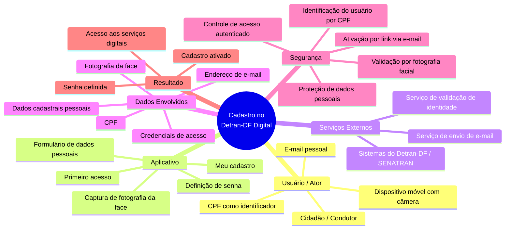
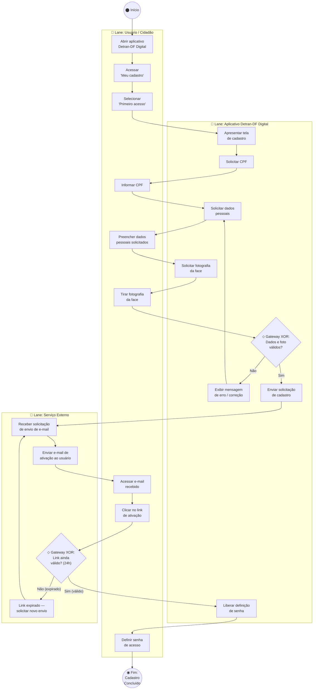

# SubEquipe 04 — Relatório de Arquitetura de Software

## Fluxo de Cadastro do App Detran-DF Digital

**Projeto:** Detran-DF Digital — Aplicativo Móvel  
**Fluxo analisado:** Cadastro / Primeiro Acesso  
**Disciplina:** Arquitetura e Desenho de Software (FGA0208)  
**Grupo:** 06 — Turma 02  

---

## FOCO 01: Artefatos Generalistas & NFR Framework

### Participantes no Foco 01

| Nome do Membro | Contribuição |
|---|---|
| Felipe Henrique Oliveira Sousa | Elaboração do Mapa Mental, construção do SIG de Segurança na notação do NFR Framework e redação da metodologia |

### Metodologia do Foco 01

O trabalho foi realizado de forma individual, iniciando pela definição do escopo: o fluxo de **primeiro acesso/cadastro** do aplicativo Detran-DF Digital. A escolha desse fluxo permite observar diferentes aspectos arquiteturais, especialmente o tratamento de informações pessoais, autenticação, validação de identidade e experiência do usuário.

A metodologia consistiu em:

1. **Exploração do aplicativo**: execução do fluxo de cadastro no aplicativo Android do Detran-DF, registrando telas, inputs exigidos e mensagens de retorno.
2. **Consulta à documentação oficial**: verificação das orientações publicadas pelo Detran-DF sobre o processo de primeiro acesso.
3. **Brainstorming e organização visual**: utilização de Mapa Mental para estruturar os principais elementos, atores e dependências do fluxo.
4. **Modelagem de requisitos não funcionais**: construção do Softgoal Interdependency Graph (SIG) com base no NFR Framework (CHUNG et al., 2000), focando no atributo de qualidade **Segurança**.

Como mecanismo de rastreabilidade, foram utilizados commits no repositório Git com mensagens descritivas, permitindo acompanhar a evolução dos artefatos.

> **Nota metodológica:** A análise adotou a abordagem de **caixa-preta** (Black-Box Reverse Engineering). Todas as informações reportadas como fatos foram diretamente observadas no aplicativo ou extraídas da documentação oficial. Tecnologias internas, protocolos e algoritmos específicos são tratados como **inferências ou hipóteses**, não como certezas.

---

### Mapa Mental

O Mapa Mental a seguir organiza o ecossistema do fluxo de cadastro no App Detran-DF Digital, em nível generalista:



#### Descrição do Mapa Mental

O artefato organiza o domínio em **6 eixos principais**:

| Eixo | Descrição |
|---|---|
| **Usuário / Ator** | Identifica quem interage com o fluxo e os recursos necessários (CPF, dispositivo com câmera, e-mail) |
| **Aplicativo** | Mapeia as etapas visíveis ao usuário dentro do app: acesso, formulário, captura facial, definição de senha |
| **Serviços Externos** | Destaca as dependências de infraestrutura de terceiros (e-mail, validação de identidade, bases do Detran/SENATRAN) |
| **Dados Envolvidos** | Documenta a carga de informações requerida para o cadastro |
| **Segurança** | Enfatiza os mecanismos de proteção observados: identificação por CPF, biometria facial, ativação por e-mail |
| **Resultado** | Representa a saída esperada: cadastro ativo com acesso aos serviços |

> **Rastreabilidade:** O Mapa Mental foi construído com base no comportamento observado diretamente no aplicativo e na documentação oficial do Detran-DF, que descreve o passo a passo do primeiro acesso.

---

### NFR Framework — SIG de Segurança do Cadastro

#### Justificativa da Escolha do Atributo de Qualidade

A escolha de **Segurança** como atributo de qualidade principal está relacionada ao fato de o fluxo de cadastro manipular **informações pessoais sensíveis** (CPF, dados cadastrais, fotografia facial, e-mail e credenciais de acesso). Em um contexto governamental de prestação de serviços públicos digitais, a segurança constitui uma preocupação arquitetural fundamental para evitar fraudes, proteger a identidade do cidadão e cumprir a legislação de proteção de dados (Lei nº 13.709/2018 — LGPD).

O NFR Framework (CHUNG et al., 2000) trata requisitos não funcionais como *softgoals* — objetivos que não possuem critérios de satisfação binários, sendo avaliados como "*satisficed*" (suficientemente satisfeitos) ou não. O framework utiliza o **Softgoal Interdependency Graph (SIG)** para representar as relações de decomposição e contribuição entre softgoals e operacionalizações.

#### Softgoal Interdependency Graph (SIG)

```
                        ╔══════════════════════════════════╗
                        ║   Segurança do Cadastro [NFR]    ║
                        ╚══════════════╤═══════════════════╝
                                       │
                 ┌─────────────────────┼─────────────────────┐
                 │ (AND)               │ (AND)               │ (AND)
                 ▼                     ▼                     ▼
  ╔══════════════════════╗  ╔═════════════════════╗  ╔══════════════════════╗
  ║ Identificação Segura ║  ║ Autenticação Segura ║  ║  Proteção de Dados   ║
  ║       [NFR]          ║  ║       [NFR]         ║  ║       [NFR]          ║
  ╚══════════╤═══════════╝  ╚══════════╤══════════╝  ╚══════════╤═══════════╝
             │                         │                        │
     ┌───────┼───────┐          ┌──────┼──────┐          ┌──────┼──────┐
     │       │       │          │      │      │          │      │      │
     ▼       ▼       ▼          ▼      ▼      ▼          ▼      ▼      ▼
   (O1)    (O2)    (O3)       (O4)   (O5)   (O6)       (O7)   (O8)   (O9)
```

**Legenda das Operacionalizações:**
- **(O1)** Validação do CPF na base cadastral
- **(O2)** Validação dos dados cadastrais informados
- **(O3)** Validação da fotografia facial
- **(O4)** Ativação da conta por link enviado ao e-mail
- **(O5)** Definição de senha pelo usuário
- **(O6)** Controle de credenciais de acesso
- **(O7)** Proteção dos dados pessoais armazenados
- **(O8)** Proteção da fotografia da face
- **(O9)** Vinculação da conta ao titular do CPF

#### Tabela de Decomposição e Operacionalização

| Tipo | Nome | Relação | Justificativa |
|---|---|---|---|
| **NFR Softgoal (Raiz)** | Segurança do Cadastro | — | Requisito fundamental para evitar fraudes em contas de cidadãos e proteger dados pessoais em contexto governamental |
| **NFR Softgoal** | Identificação Segura | AND (com a raiz) | Garante que o usuário cadastrado é o legítimo titular do CPF, por meio de validações múltiplas |
| **NFR Softgoal** | Autenticação Segura | AND (com a raiz) | Assegura que somente o usuário legítimo consiga ativar e acessar a conta cadastrada |
| **NFR Softgoal** | Proteção de Dados | AND (com a raiz) | Atendimento à LGPD (Lei nº 13.709/2018) no tratamento de dados pessoais e biométricos |
| **Operacionalização (O1)** | Validação do CPF | HELP (+) → Identificação Segura | O CPF é utilizado como identificador inicial; sua validação contra a base cadastral reduz cadastros indevidos |
| **Operacionalização (O2)** | Validação dos dados cadastrais | HELP (+) → Identificação Segura | Os dados informados pelo usuário são confrontados com registros existentes para confirmar a identidade |
| **Operacionalização (O3)** | Validação da fotografia facial | MAKE (++) → Identificação Segura | A captura da face e sua validação contra a base do SENATRAN constitui o mecanismo mais forte de comprovação de identidade observado |
| **Operacionalização (O4)** | Ativação por link via e-mail | MAKE (++) → Autenticação Segura | A ativação externa via e-mail adiciona uma camada de verificação de posse do endereço eletrônico informado |
| **Operacionalização (O5)** | Definição de senha | MAKE (++) → Autenticação Segura | A criação de credencial de acesso pessoal pelo usuário é essencial para o controle de autenticação |
| **Operacionalização (O6)** | Controle de credenciais | HELP (+) → Autenticação Segura | Mecanismos de controle sobre as credenciais (e.g., validade do link de 24h) contribuem para a segurança |
| **Operacionalização (O7)** | Proteção dos dados pessoais | MAKE (++) → Proteção de Dados | Dados como CPF, nome e e-mail devem ser protegidos contra acesso não autorizado, conforme LGPD |
| **Operacionalização (O8)** | Proteção da fotografia facial | MAKE (++) → Proteção de Dados | A fotografia constitui dado biométrico sensível (art. 5º, II da LGPD) e exige proteção reforçada |
| **Operacionalização (O9)** | Vinculação conta-titular | HELP (+) → Proteção de Dados | Garante que cada conta está vinculada a um único titular, evitando duplicidade e acesso cruzado |

> **Embasamento:** A modelagem segue a notação do NFR Framework conforme CHUNG et al. (2000), utilizando *softgoals* representados como nuvens, decomposição AND e contribuições do tipo MAKE (++) e HELP (+). A ISO/IEC 25010:2023 foi utilizada como referência complementar para a definição das subcaracterísticas de segurança.

---

## FOCO 02: Engenharia Reversa & Modelagem BPMN

### Participantes no Foco 02

| Nome do Membro | Contribuição |
|---|---|
| Felipe Henrique Oliveira Sousa | Execução da Engenharia Reversa, levantamento das etapas do cadastro, desenho e validação do modelo BPMN |

### Metodologia do Foco_02

A equipe adotou uma abordagem de **Engenharia Reversa por Caixa-Preta** (Black-Box Reverse Engineering), analisando o comportamento externo do aplicativo Detran-DF Digital sem acesso ao código-fonte ou à documentação arquitetural interna.

Segundo Chikofsky e Cross (1990), a Engenharia Reversa é "*o processo de análise de um sistema para identificar seus componentes, inter-relações e criar representações do sistema em uma forma de abstração mais elevada*". No contexto deste trabalho, o processo visou recuperar o modelo conceitual do fluxo de cadastro a partir do comportamento observável.

O processo foi conduzido nas seguintes etapas:

1. **Definição do escopo**: seleção do fluxo de primeiro acesso / cadastro como objeto de estudo.
2. **Levantamento das etapas visíveis**: execução do fluxo no aplicativo Android, registrando cada tela e input exigido.
3. **Execução do fluxo de cadastro**: realização completa do processo de primeiro acesso.
4. **Registro das telas e ações**: captura de tela das etapas para documentação.
5. **Consulta à documentação oficial**: verificação junto ao portal do Detran-DF das orientações publicadas sobre o cadastro.
6. **Identificação dos atores e sistemas**: mapeamento dos participantes do processo (cidadão, aplicativo, serviços externos).
7. **Análise de comportamento dinâmico**: teste de limites (inputs inválidos, interrupção de conexão, recusa de permissão de câmera).
8. **Reconstrução do fluxo lógico**: tradução dos comportamentos observados em regras formais de negócio.
9. **Modelagem em BPMN**: representação do processo na notação BPMN 2.0.
10. **Versionamento dos artefatos**: registro no repositório Git.

---

### Processo de Engenharia Reversa Aplicado

#### Contexto

O objeto analisado foi o fluxo de **cadastro / primeiro acesso** do aplicativo Detran-DF Digital. A documentação oficial do Detran-DF confirma que o processo consiste em: acessar **"Meu cadastro"**, selecionar **"Primeiro acesso"**, informar o CPF e os dados solicitados, realizar uma fotografia da face e, posteriormente, receber um e-mail com um link para ativação do cadastro e definição da senha. O link possui **validade de 24 horas**.

#### Etapas Identificadas na Engenharia Reversa

| Etapa | Descrição | Tipo de Informação |
|---|---|---|
| 1. Acesso ao aplicativo | O usuário instala e abre o aplicativo Detran-DF Digital | Evidência |
| 2. Acesso à área de cadastro | O usuário acessa "Meu cadastro" e seleciona "Primeiro acesso" | Evidência |
| 3. Identificação inicial | O usuário informa seu CPF e os demais dados solicitados pelo aplicativo | Evidência |
| 4. Captura da face | O aplicativo solicita uma fotografia da face utilizando a câmera do dispositivo. A orientação oficial alerta que a foto deve ser da face (não de documentos) e recomenda iluminação adequada | Evidência |
| 5. Envio de e-mail | O sistema utiliza o e-mail informado para enviar um link de ativação com validade de 24 horas | Evidência |
| 6. Ativação | O usuário acessa o link recebido por e-mail para ativar o cadastro | Evidência |
| 7. Definição de senha | Após a ativação, o usuário define sua senha de acesso | Evidência |

#### Achados da Engenharia Reversa

| Elemento | Observação | Tipo |
|---|---|---|
| Ator principal | Cidadão / Usuário | Evidência |
| Sistema principal | Aplicativo Detran-DF Digital | Evidência |
| Identificador | CPF | Evidência |
| Dados de cadastro | Informações pessoais solicitadas pelo aplicativo | Evidência |
| Mecanismo de identificação | Fotografia da face validada contra base do SENATRAN | Inferência |
| Comunicação externa | E-mail cadastrado pelo usuário | Evidência |
| Autenticação | Credencial / senha definida após ativação | Evidência |
| Ativação | Link recebido por e-mail com validade de 24h | Evidência |
| Resultado | Cadastro ativado com acesso aos serviços digitais | Evidência |

#### Distinção entre Evidência, Inferência e Hipótese

A equipe adotou a seguinte diferenciação para aumentar a confiabilidade do relatório:

| Classificação | Definição | Exemplo neste fluxo |
|---|---|---|
| **Evidência** | Informação diretamente observada no app ou documentada oficialmente pelo Detran-DF | O cadastro exige CPF, fotografia facial e ativação por e-mail |
| **Inferência** | Comportamento deduzido a partir de evidências observadas | A fotografia facial é validada contra a base do SENATRAN (deduzido pela mensagem de retorno do app) |
| **Hipótese** | Possível implementação interna que não pôde ser confirmada | Possível uso de protocolos específicos de criptografia ou APIs internas |

> **Senso crítico:** Esta distinção é fundamental para evitar que suposições sobre a implementação interna sejam apresentadas como fatos. Sem acesso ao código-fonte, ao backend ou às APIs, determinadas características permanecem como hipóteses.

---

### Modelagem BPMN

O modelo a seguir representa o fluxo de cadastro do cidadão, recuperado via Engenharia Reversa, na notação BPMN 2.0 (OMG, 2013). A modelagem utiliza Pools, Lanes, Gateways Exclusivos (XOR) e Eventos conforme a especificação.

#### Pool: Detran-DF Digital — Cadastro (Primeiro Acesso)

**Lanes:**
- **Lane 1 — Usuário (Cidadão)**
- **Lane 2 — Aplicativo Detran-DF Digital**
- **Lane 3 — Serviço de E-mail / Validação Externa**

#### Diagrama BPMN



#### Elementos-Chave da Modelagem BPMN

| Elemento BPMN | Representação no Fluxo |
|---|---|
| **Evento de Início** | Cidadão abre o aplicativo com intenção de se cadastrar |
| **Tarefas de Usuário** | Informar CPF, preencher dados, tirar foto, acessar e-mail, definir senha |
| **Tarefas de Sistema** | Apresentar formulário, solicitar dados, enviar solicitação, liberar definição de senha |
| **Gateway Exclusivo (XOR) 1** | "Dados e foto válidos?" — direciona para correção ou prosseguimento |
| **Gateway Exclusivo (XOR) 2** | "Link ainda válido (24h)?" — redireciona para reenvio ou ativação |
| **Evento de Fim** | Cadastro concluído com senha definida |
| **Fluxo de Mensagem** | Comunicação entre Lanes (App → Serviço de E-mail → Usuário) |

> **Embasamento:** A modelagem segue a especificação BPMN 2.0.2 (OMG, 2013), utilizando os elementos de Pool, Lanes, Tarefas, Gateways Exclusivos e Eventos de Início/Fim. A notação BPMN foi escolhida por ser um padrão internacional reconhecido para a modelagem de processos de negócio.

---

## FOCO 03: IA Generativa

### Participantes no Foco 03

| Nome do Membro | Lições Aprendidas | Uso da IA Generativa (Senso Crítico) |
|---|---|---|
| Felipe Henrique Oliveira Sousa | Compreendi como aplicar a Engenharia Reversa por caixa-preta para recuperar processos de software fechados, a importância de distinguir evidências de inferências, e como estruturar o NFR Framework identificando Softgoals de segurança alinhados à LGPD. Também aprendi a traduzir fluxos de validação em notação BPMN 2.0 com Pools, Lanes e Gateways. | A IA Generativa auxiliou na estruturação inicial dos rascunhos e na revisão ortográfica do relatório. Também contribuiu para buscar definições teóricas (conceitos de Chikofsky & Cross, NFR Framework). Entretanto, a IA demonstrou **limitações relevantes**: (1) confundiu Softgoals com Requisitos Funcionais na notação do NFR Framework; (2) simplificou demais os Gateways do BPMN, omitindo caminhos de exceção; (3) utilizou `sequenceDiagram` do Mermaid como se fosse BPMN, o que é tecnicamente incorreto; e (4) assumiu tecnologias internas (OAuth2, JWT, TLS 1.3) como fatos, contradizendo a abordagem de caixa-preta. Todas essas saídas exigiram **intervenção manual e correção** com base na literatura especializada (Chung et al., 2000; OMG, 2013) e na observação direta do aplicativo. A IA foi utilizada como ferramenta de apoio, nunca como substituta da análise técnica. |

---

## Versionamentos

| Nome do Membro | Contribuição | Data |
|---|---|---|
| Felipe Henrique Oliveira Sousa | Criação da estrutura do relatório, elaboração do Mapa Mental e texto metodológico do Foco_01 | 27/08/2026 |

---

## Referências Bibliográficas

CHIKOFSKY, Elliot J.; CROSS, James H. Reverse engineering and design recovery: A taxonomy. **IEEE Software**, v. 7, n. 1, p. 13-17, 1990.

CHUNG, Lawrence; NIXON, Brian A.; YU, Eric; MYLOPOULOS, John. **Non-Functional Requirements in Software Engineering**. Springer Science & Business Media, 2000.

DETRAN-DF. **Como acessar o Detran Digital**. Governo do Distrito Federal. Disponível em: [https://www.detran.df.gov.br/](https://www.detran.df.gov.br/).

ISO. **ISO/IEC 25010:2023** — Systems and software engineering — Systems and software Quality Requirements and Evaluation (SQuaRE) — Product quality model. International Organization for Standardization, 2023.

OMG (Object Management Group). **Business Process Model and Notation (BPMN)**, Version 2.0.2. 2013. Disponível em: [https://www.omg.org/spec/BPMN/2.0.2/](https://www.omg.org/spec/BPMN/2.0.2/).

BRASIL. **Lei Geral de Proteção de Dados Pessoais (LGPD)**. Lei nº 13.709, de 14 de agosto de 2018. Disponível em: [https://www.planalto.gov.br/ccivil_03/_ato2015-2018/2018/lei/l13709.htm](https://www.planalto.gov.br/ccivil_03/_ato2015-2018/2018/lei/l13709.htm).

PRESSMAN, Roger S.; MAXIM, Bruce R. **Engenharia de Software: Uma Abordagem Profissional**. 8. ed. São Paulo: McGraw-Hill, 2016.

---

## Histórico de Versão

| Versão | Data | Alterações | Autor |
|:---:|:---:|---|---|
| 1.0 | 27/08/2026 | Criação do documento e Mapa Mental | [Felipe Henrique](https://github.com/fhenrique77) |
